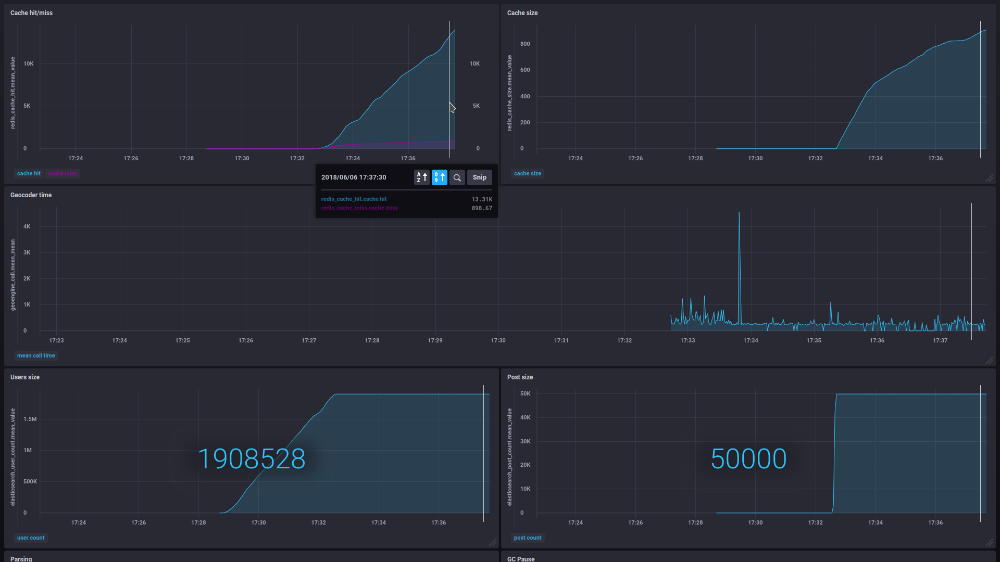
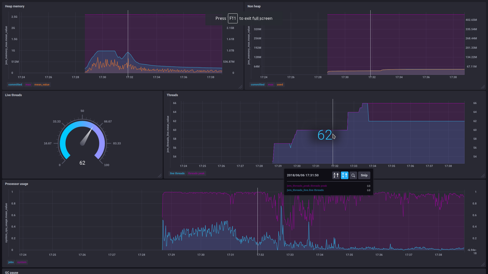

@title[Wstęp]
### Wizualizacja lokalizacji ekspertów z wykorzystaniem technologii Big Data
##### Piotr Fus

---

@title[Agenda]
### Agenda

- Dane
- Architektura
- Problemy
- Zdjęcia

---

@title[Problem]

- Mamy pomysł na startup
- Potrzebujemy ekspertów od Big Data |
- Znających dobrze R/Python |
- Gdzie powinniśmy ich szukać? |

---

@title[Cel pracy]

- Zbudowanie systemu do wizualizacji lokalizacji ekspertów wyszukiwanych po wybranych kryteriach
- Wykorzystanie danych ze Stack Overflow
- Wykorzystanie technologii ze stosu Big Data

---

@title[Dane wejściowe]

### Dane wejściowe - użytkownicy

```xml
<?xml version="1.0" encoding="utf-8"?>
<users>
  <row Id="1"
        Reputation="43078" 
        DisplayName="Jeff Atwood"
        Location="El Cerrito, CA" 
        UpVotes="3352" DownVotes="1308" />
</users>
```

+++

### Dane wejściowe - posty

```xml
<?xml version="1.0" encoding="utf-8"?>
<posts>
  <row Id="4" 
        PostTypeId="1"
        Score="543"
        OwnerUserId="8"
        Tags="&lt;c#&gt;&lt;winforms&gt;&lt;type-conversion&gt;&lt;decimal&gt;&lt;opacity&gt;" />
</posts>
```

---

@title[Architektura]
### ArchitekturaAAA


---

@title[Algorytm]
### Główny algorytm

0. Wczytanie użytkowników do Elasticsearch
0. Wczytanie postów do Elasticsearch
0. Aktualizacja użytkowników o punkty (tagi) i lokalizację

+++

### Aktualizacja o punkty (tagi) i lokalizację

Dla każdego postu typu `Odpowiedź`:

0. Wyszukanie w Elasticsearch postu nadrzędnego - pytania
0. Pobranie listy tagów
0. Połączenie tagów z punktami przyznanymi za odpowiedź
0. Wyszukanie użytkownika w Elasticsearch
0. Połączenie z wcześniejszymi wyliczeniami
0. Pobranie lokalizacji z geokodera
0. Aktualizacja użytkownika

---

@title[Problemy]

## Problemy...
### i rozwiązania

+++

### Geokoder

- Usługa zamieniająca adresy podane słownie na współrzędne geograficzne |
- Testowane - Nominatim (OSM) i Google Geocoding API |
- Problemy wydajnościowe i limity |
- Duża powtarzalność tych samych wpisów w danych |
- Cache w Redis |

+++

### Parsowanie pliku

- spark-xml |
- Scala XML |
- Parsowanie ręczne |

+++

### Organizacja indeksu

- Nested objects |
- Dynamic fields |
- Limit pól w indeksie |
- Zapisywanie tylko najpopularniejszych tagów |

---

@title[Monitoring]
### Monitoring

- Stos TICK
- Micrometer
- Mierzone czasy wykonania zadań, statystyki biznesowe
- Metryki Spark, JVM, Redis, Elasticsearch

---

@title[Zdjęcia]

### Kibana


+++

### Metryki aplikacji



+++

### Metryki JVM



---

@title[Podsumowanie]

### Podsumowanie

- Aplikacja pozwala na budowanie różnych kryteriów do wyszukania ekspertów |
- Kibana pozwala na wizualizację lokalizacji, w tym różne mapy gęstości |
- Wykorzystane zostały technologie Big Data |
- Cel pracy został osiągnięty |
